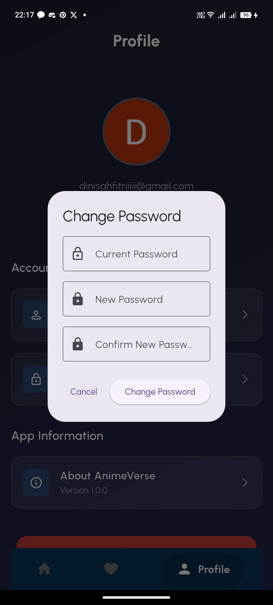
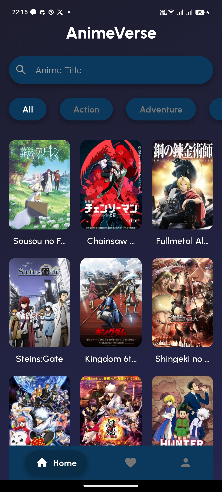
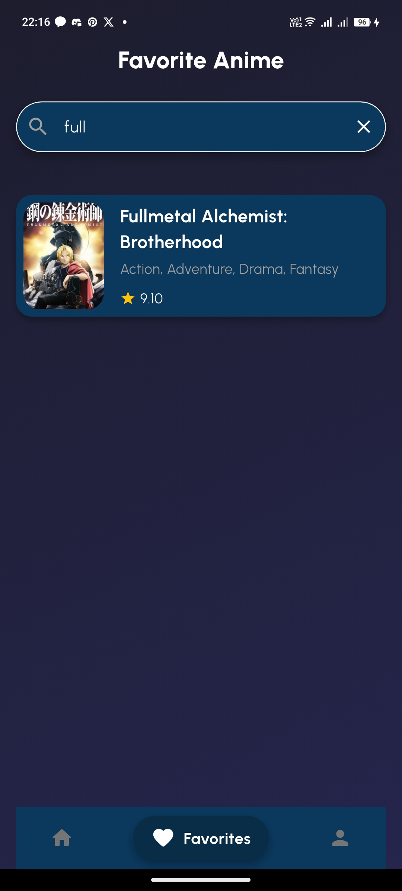
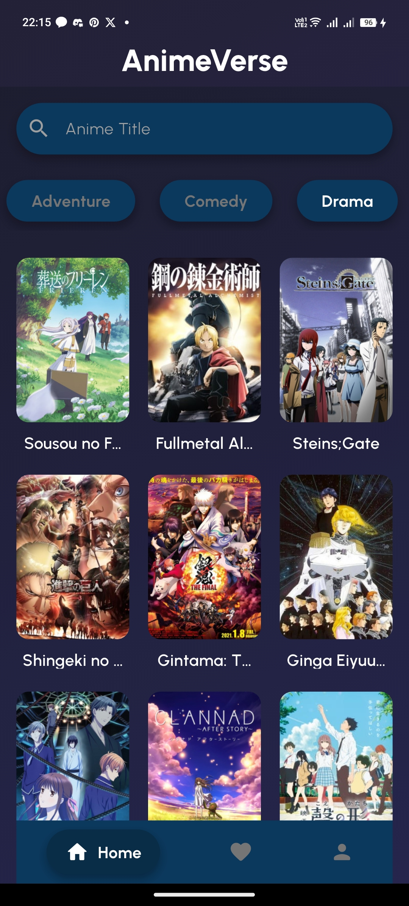
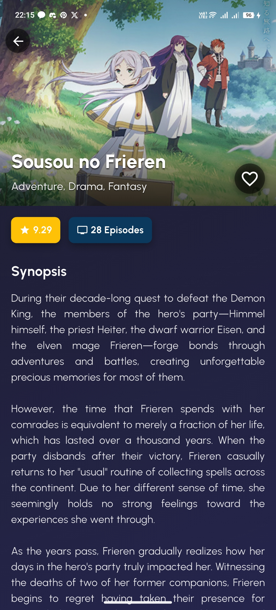
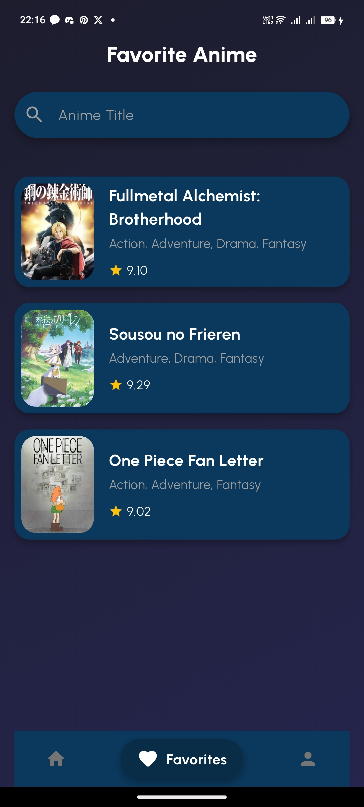
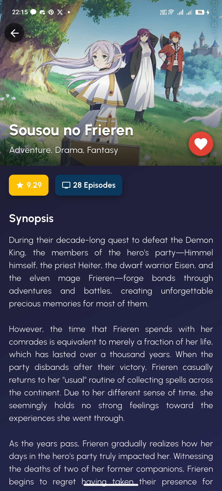
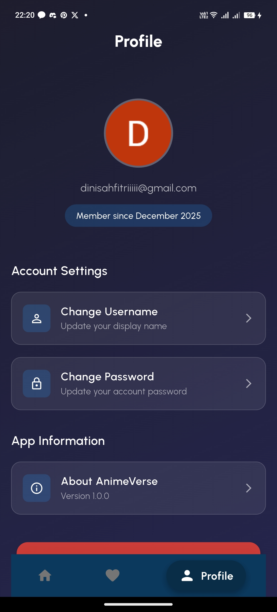

# Anime Verse

Anime Verse adalah aplikasi mobile berbasis Flutter untuk mencari anime, melihat detail anime, menyimpan daftar favorit, dan melakukan filter berdasarkan genre. Aplikasi ini menggunakan Firebase untuk autentikasi dan penyimpanan favorit.

---
Nama : Dini Sahfitri 
Nim : 231401033 
Bidang Studi Ilmu Komputer Universitas Sumatera Utara 

### Fitur Utama
#### 1. Menampilkan daftar anime
#### 2. Pencarian Anime  
#### 3. Daftar ANime Favorit  
#### 4. Filter Anime Berdasarkan Genre  
- Memilih genre seperti Action, Romance, Mystery, dll.  
#### 5. Authentication Login, Register, dan Reset Password.  
#### 6. Pagination  
- Infinite scroll.  
- Mengambil data halaman berikutnya secara bertahap.

---

### Teknologi yang Digunakan

- Flutter (Dart)
- Firebase Authentication
- Firebase Cloud Firestore
- Jikan API (sumber data anime)
- Provider (State Management)

---

### Application Preview
Authentication Screens
<table> <tr> <td> <b>Sign Up</b></td> <td> <b>Sign In</b></td> <td> <b>Reset Password</b></td> </tr> <tr> <td> <b>Change Password</b></td> </tr> </table>
Home & Navigation
<table> <tr> <td> <b>Home</b></td> <td> <b>Search Anime</b></td> <td> <b>Filter by Genre</b></td> </tr> </table>
Anime Details & Favorites
<table> <tr> <td> <b>Anime Detail</b></td> <td> <b>Favorite List</b></td> <td> <b>Favorite Detail</b></td> </tr> </table>
User Profile
<table> <tr> <td> <b>Profile</b></td> </tr> </table>

### Link Demo Aplikasi

